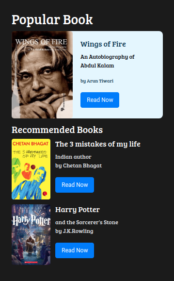
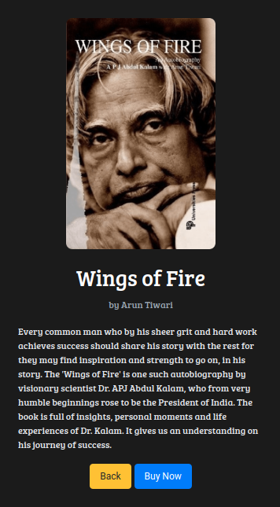
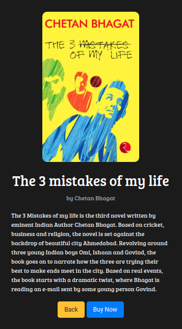
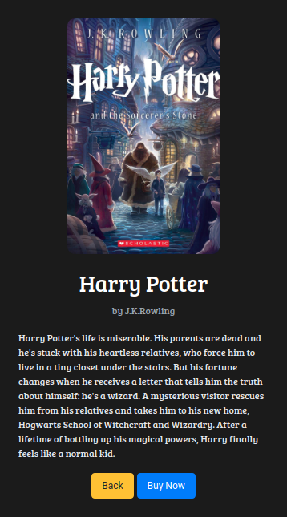

# 📚 Book Store Page

**Status:** Solved
**Difficulty:** Easy

---

## 📖 Assignment Description

In this assignment, let's build a **Book Store Page** by applying the concepts learned so far. Bootstrap concepts and the **CCBP UI Kit** can also be used.

The project consists of multiple sections:

- Book Store Home Page
- Wings of Fire Book Details Page
- The 3 Mistakes of My Life Book Details Page
- Harry Potter Book Details Page

When the **Read Now** button is clicked on the Home Page, the respective book details page should be displayed.

---

## 🖼️ Reference Design

### Book Store Home Page



### Wings of Fire Details Page



### The 3 Mistakes of My Life Details Page



### Harry Potter Details Page



---

## ⚠️ Notes

- Try to achieve the design as close as possible.
- Clicking **Read Now** should navigate to the corresponding book details page.
- Bootstrap and CCBP UI Kit can be used.

---

## 🚨 Important CCBP UI Kit Guidelines

### Section IDs

The CCBP UI Kit works only when section IDs start with the prefix `section`.

✅ Correct:

```html id="n4r2vw"
<div id="sectionHomePage"></div>
<div id="sectionWingsOfFirePage"></div>
```

### Section Structure

- Sections must be parallel.
- Sections should not be nested within each other.

### Bootstrap Usage

Avoid applying Bootstrap flex properties directly to section containers.

---

## 📦 Resources

### Book Images

- https://d2clawv67efefq.cloudfront.net/ccbp-static-website/book-apj-img.png
- https://d2clawv67efefq.cloudfront.net/ccbp-static-website/book-chetan-bhagat-img.png
- https://d2clawv67efefq.cloudfront.net/ccbp-static-website/harrypotter-img.png

---

## 🎨 Design Details

### Font Families

- **Roboto**
- **Bree Serif**

### Styling

- Custom background colors and text colors as provided in the assignment design.
- Responsive layouts built using Bootstrap and CCBP UI Kit.

---

## 📂 Project Structure

```text id="8a9e1v"
book-store-page/
├── index.html
├── style.css
├── README.md
└── reference-image/
    ├── book-store-v1.png
    ├── book-store-wings-for-fire-v1.png
    ├── book-store-3-mistakes-v1.png
    └── book-store-harry-potter-v1.png
```

---

## 📚 Concepts Practiced

- CCBP UI Kit Navigation
- Multi-Section Web Applications
- Bootstrap Components
- Responsive Layout Design
- Content Cards
- Image Integration
- HTML Structure
- CSS Styling

---

## 🎯 Learning Outcome

Through this project, I learned how to:

- Create multi-section applications using CCBP UI Kit
- Navigate between pages using buttons
- Design book showcase and detail pages
- Build responsive layouts with Bootstrap
- Organize content effectively across multiple sections

---

## 🛠️ Technologies Used

- HTML5
- CSS3
- Bootstrap
- CCBP UI Kit

---

⭐ This project is part of my **NxtWave Coding Practice Repository** and reflects my progress in learning modern web development concepts.
