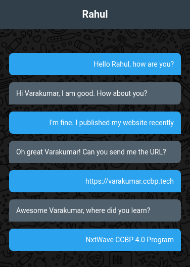

# 💬 Chat Page

**Status:** Solved
**Difficulty:** Easy

---

## 📖 Assignment Description

In this assignment, let's build a **Chat Page** by applying the concepts we learned till now.

The objective is to create a chat interface that resembles the given reference design, using HTML and CSS concepts learned in the Static Websites module.

---

## 🖼️ Reference Design




---

## ⚠️ Note

* Try to achieve the design as close as possible.

---

## 📦 Resources

### Background Image

https://d2clawv67efefq.cloudfront.net/ccbp-static-website/chatbg.png

---

## 🎨 CSS Details

### Colors Used

#### Text Color

* `#ffffff`

#### Background Color for Heading

* `#323f4b`

#### Background Colors for Chat Messages

* `#47a3f3`
* `#52606d`

### Font Family

* **Roboto**

---

## 📂 Project Structure

```text
chat-page/
├── index.html
├── style.css
├── README.md
└── referenceimage/
    └── reference-design.png
```

---

## 📚 Concepts Practiced

* HTML page structure
* Text and container styling
* Background images
* CSS colors and typography
* Alignment and spacing
* Building chat-style UI layouts

---

## 🎯 Learning Outcome

Through this project, I learned how to:

* Create a structured chat interface using HTML
* Apply background images effectively
* Style message bubbles using CSS
* Work with colors, spacing, and typography
* Recreate a given UI design with attention to detail

---

⭐ This project is part of my **NxtWave Coding Practice Repository** and reflects my progress in learning web development concepts.
