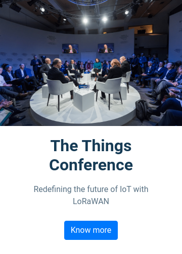

# 🎤 Conference Page

**Status:** Solved
**Difficulty:** Easy

---

## 📖 Assignment Description

In this assignment, let's build a **Conference Page** by applying the concepts learned so far. Bootstrap concepts and the **CCBP UI Kit** can also be used.

The project consists of two pages:

- **Conference Home Page**
- **Conference Details Page**

When the **"Know More"** button on the Home Page is clicked, the user should be navigated to the Conference Details Page.

---

## 🖼️ Reference Design

### Home Page



### Details Page


---

## ⚠️ Notes

- Try to achieve the design as close as possible.
- Clicking the **Know More** button should navigate to the Conference Details Page.
- Bootstrap and CCBP UI Kit can be used.

---

## 🚨 Important CCBP UI Kit Guidelines

### Section IDs

The CCBP UI Kit works only when section IDs start with the prefix `section`.

✅ Correct:

```html
<div id="sectionHomePage"></div>
<div id="sectionConferencePage"></div>
```

❌ Incorrect:

```html
<div id="homePage"></div>
```

### Section Structure

- Sections must be **parallel**.
- Sections should **not be nested** inside one another.

### Bootstrap Usage

Avoid applying Bootstrap flex properties directly to section containers.

❌ Example:

```html
<div id="sectionHomepage" class="d-flex"></div>
```

---

## 📦 Resources

### Conference Image

- https://d2clawv67efefq.cloudfront.net/ccbp-static-website/conference-img.png

### YouTube Video

- https://www.youtube.com/embed/W_2hCKnzWj0

---

## 🎨 Design Details

### Font Family

- **Roboto**

---

## 📂 Project Structure

```text
conference-page/
├── index.html
├── style.css
├── README.md
└── reference-image/
    ├── conference-page-1-v1.png
    └── Screenshot%20from%202024-12-31%2010-08-51.png
```

---

## 📚 Concepts Practiced

- Bootstrap Components
- CCBP UI Kit
- Multi-section Navigation
- Responsive Layout Design
- YouTube Video Embedding
- HTML Structure
- CSS Styling
- UI Organization

---

## 🎯 Learning Outcome

Through this project, I learned how to:

- Create multi-page experiences using CCBP UI Kit sections
- Navigate between sections using buttons
- Embed YouTube videos within webpages
- Build responsive layouts using Bootstrap
- Follow UI Kit conventions and best practices

---

## 🛠️ Technologies Used

- HTML5
- CSS3
- Bootstrap
- CCBP UI Kit

---

⭐ This project is part of my **NxtWave Coding Practice Repository** and reflects my progress in learning modern web development concepts.
