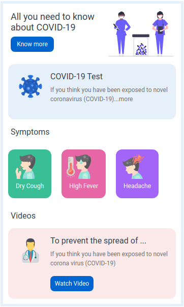

# 🦠 COVID-19 Page

**Status:** Solved
**Difficulty:** Easy

---

## 📖 Assignment Description

In this assignment, let's build a **COVID-19 Page** by applying the concepts learned so far. Bootstrap concepts can also be used to create the page.

The objective is to create an informative webpage about COVID-19, displaying prevention information, symptoms, and health-related content in a visually appealing layout.

---

## 🖼️ Reference Design



---

## ⚠️ Note

- Try to achieve the design as close as possible.

---

## 📦 Resources

### Images Used

- https://d2clawv67efefq.cloudfront.net/ccbp-static-website/medicalcare-img.png
- https://d2clawv67efefq.cloudfront.net/ccbp-static-website/coronavirus-img.png
- https://d2clawv67efefq.cloudfront.net/ccbp-static-website/cough-img.png
- https://d2clawv67efefq.cloudfront.net/ccbp-static-website/fever-img.png
- https://d2clawv67efefq.cloudfront.net/ccbp-static-website/headache-img.png
- https://d2clawv67efefq.cloudfront.net/ccbp-static-website/doctor-img.png

---

## 🎨 Design Details

### Font Family

- **Roboto**

### Styling

- Custom background colors and border colors as provided in the assignment design.
- Responsive layout created using Bootstrap components.

---

## 📂 Project Structure

```text
covid-19-page/
├── index.html
├── style.css
├── README.md
└── reference-image/
    └── covid-v1.png
```

---

## 📚 Concepts Practiced

- HTML page structure
- CSS styling and layouts
- Bootstrap components
- Cards and content sections
- Image integration
- Responsive design principles
- Typography and color styling

---

## 🎯 Learning Outcome

Through this project, I learned how to:

- Create informative and user-friendly webpages
- Organize health-related content using Bootstrap layouts
- Use images effectively to improve visual communication
- Apply responsive design techniques
- Build structured content sections with cards and containers

---

## 🛠️ Technologies Used

- HTML5
- CSS3
- Bootstrap

---

⭐ This project is part of my **NxtWave Coding Practice Repository** and reflects my progress in learning modern web development concepts.
