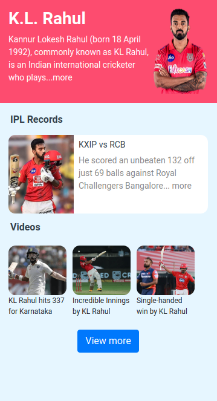

# 🏏 Cricketer Page

**Status:** Solved
**Difficulty:** Easy

---

## 📖 Assignment Description

In this assignment, let's build a **Cricketer Page** by applying the concepts learned so far. Bootstrap concepts can also be used to create the page.

The objective is to create a profile page for a cricketer by displaying information, images, and achievements in an attractive and structured layout.

> This is a sample Cricketer Page. You can build your favorite cricketer's page using this as a reference.

---

## 🖼️ Reference Design



---

## ⚠️ Note

- Try to achieve the design as close as possible.
- This assignment uses KL Rahul's profile as a sample reference.

---

## 📦 Resources

### Images Used

- https://d2clawv67efefq.cloudfront.net/ccbp-static-website/klrahul-img1.png
- https://d2clawv67efefq.cloudfront.net/ccbp-static-website/klrahul-img2.png
- https://d2clawv67efefq.cloudfront.net/ccbp-static-website/klrahul-img3.png
- https://d2clawv67efefq.cloudfront.net/ccbp-static-website/klrahul-img4.png
- https://d2clawv67efefq.cloudfront.net/ccbp-static-website/klrahul-img5.png

---

## 🎨 Design Details

### Top Section Background Color

- `#fb4e71`

### Bottom Section Background Color

- `#e6f6ff`

### Card Background Color

- `#ffffff`

### Text Colors

- `#ffffff`
- `#323f4b`
- `#888888`

### Font Family

- **Roboto**

---

## 📂 Project Structure

```text
cricketer-page/
├── index.html
├── style.css
├── README.md
└── reference-image/
    └── cricketer-v1.png
```

---

## 📚 Concepts Practiced

- HTML page structure
- CSS styling and layouts
- Bootstrap components
- Cards and content sections
- Image integration
- Typography and color styling

---

## 🎯 Learning Outcome

Through this project, I learned how to:

- Create profile-based webpage layouts
- Organize content using Bootstrap components
- Display images effectively within a webpage
- Apply color schemes and typography for better UI
- Build visually appealing information cards

---

## 🛠️ Technologies Used

- HTML5
- CSS3
- Bootstrap

---

⭐ This project is part of my **NxtWave Coding Practice Repository** and reflects my progress in learning modern web development concepts.
