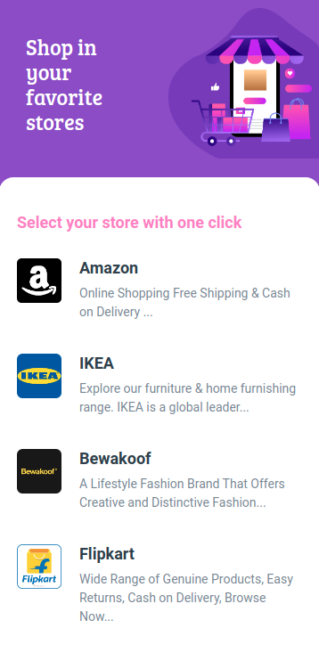

# 🛍️ Favorite Stores Page

**Status:** Solved
**Difficulty:** Easy

---

## 📖 Assignment Description

In this assignment, let's build a **Favorite Stores Page** by applying the concepts learned so far. Bootstrap concepts can also be used to create the page.

The objective is to create a webpage that showcases a collection of favorite online stores along with their logos and descriptions in an attractive and user-friendly layout.

---

## 🖼️ Reference Design



---

## ⚠️ Note

* Try to achieve the design as close as possible.

---

## 📦 Resources

### Images

* https://assets.ccbp.in/frontend/static-website/stores-img.png
* https://assets.ccbp.in/frontend/static-website/amazon-logo-img.png
* https://assets.ccbp.in/frontend/static-website/ikea-logo-img.png
* https://assets.ccbp.in/frontend/static-website/bewakoof-logo-img.png
* https://assets.ccbp.in/frontend/static-website/flipkart-logo-img.png

---

## 🎨 Design Details

### Background Colors

* `#894bca`
* `#ffffff`

### Text Colors

* `#f780c3`
* `#ffffff`
* `#323f4b`
* `#7b8794`

### Font Family

* **Bree Serif**

---

## 📂 Project Structure

```text
favorite-stores-page/
├── index.html
├── style.css
├── README.md
└── reference-image/
    └── favourite-stores-output-img.png
```

---

## 📚 Concepts Practiced

* HTML Page Structure
* CSS Styling
* Bootstrap Components
* Cards and Layout Design
* Image Integration
* Typography and Color Styling
* Responsive Design Principles

---

## 🎯 Learning Outcome

Through this project, I learned how to:

* Design visually appealing store listing pages
* Organize content using cards and sections
* Work with images and branding elements
* Apply color schemes and typography effectively
* Build responsive layouts using Bootstrap

---

## 🛠️ Technologies Used

* HTML5
* CSS3
* Bootstrap

---

## 🚀 Future Enhancements

* Add links to store websites
* Improve responsiveness for all devices
* Add hover effects and animations
* Include more favorite stores dynamically

---

⭐ This project is part of my **NxtWave Coding Practice Repository** and reflects my progress in learning modern web development concepts.
