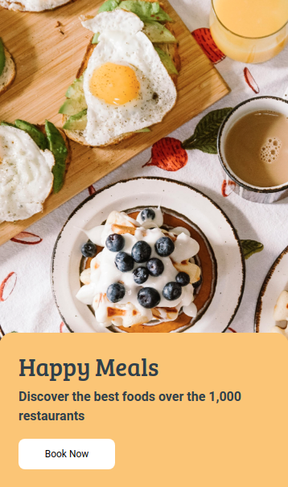

# 🍔 Food Order Page

**Status:** Solved
**Difficulty:** Easy

---

## 📖 Assignment Description

In this assignment, let's build a **Food Order Page** by applying the Bootstrap concepts learned so far.

The goal is to create an attractive food ordering interface based on the provided reference design while making effective use of Bootstrap components and styling techniques.

---

## 🖼️ Reference Design



---

## ⚠️ Note

- Try to achieve the design as close as possible.

---

## 📦 Resources

### Background Image

https://d2clawv67efefq.cloudfront.net/ccbp-static-website/foodbg.png

---

## 🎨 Design Details

### Card Background Color

- `#f6c56e`

### Button Background Color

- `#ffffff`

### Text Color

- `#323f4b`

### Font Families

#### Main Heading

- **Bree Serif**

#### Paragraph and Button

- **Roboto**

---

## 📂 Project Structure

```text
food-order-page/
├── index.html
├── style.css
├── README.md
└── reference-image/
    └── restaurant.png
```

---

## 📚 Concepts Practiced

- Bootstrap fundamentals
- Cards and containers
- Background images
- Typography styling
- Button customization
- Layout design and positioning

---

## 🎯 Learning Outcome

Through this project, I learned how to:

- Create visually appealing UI layouts using Bootstrap
- Apply background images effectively
- Design and style cards with custom colors
- Use typography to improve user experience
- Build responsive page structures

---

## 🛠️ Technologies Used

- HTML5
- CSS3
- Bootstrap

---

⭐ This project is part of my **NxtWave Coding Practice Repository** and reflects my progress in learning modern web development concepts.
