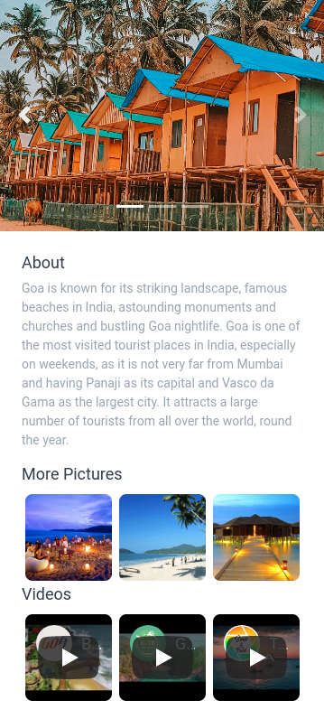

# 🌴 Goa Page

**Status:** Solved
**Difficulty:** Easy

---

## 📖 Assignment Description

In this assignment, let's build a **Goa Page** by applying the concepts learned so far. Bootstrap concepts can also be used to create the page.

The objective is to create a detailed webpage showcasing Goa's attractions using image carousels, additional images, descriptive content, and embedded YouTube videos.

---

## 🖼️ Reference Design



---

## ⚠️ Notes

- Try to achieve the design as close as possible.
- Use Bootstrap Carousel to display multiple images.
- Embed YouTube videos using Bootstrap's responsive embed utilities.
- For smaller embedded videos, use `embed-responsive-1by1` instead of `embed-responsive-16by9`.

---

## 📦 Resources

### Carousel Images

- https://d2clawv67efefq.cloudfront.net/ccbp-static-website/goa-c1-img.png
- https://d2clawv67efefq.cloudfront.net/ccbp-static-website/goa-c2-img.png
- https://d2clawv67efefq.cloudfront.net/ccbp-static-website/goa-c3-img.png

### More Pictures

- https://d2clawv67efefq.cloudfront.net/ccbp-static-website/goa-more1-img.png
- https://d2clawv67efefq.cloudfront.net/ccbp-static-website/goa-more2-img.png
- https://d2clawv67efefq.cloudfront.net/ccbp-static-website/goa-more3-img.png

### YouTube Videos

- https://www.youtube.com/watch?v=NFalCkZAClY&ab_channel=GoaTourism
- https://www.youtube.com/watch?v=4irzfMfTmM8&ab_channel=EntrepreneursBeachFestivalIndia
- https://www.youtube.com/watch?v=OJu0gjzsvQE&ab_channel=SoulandFuel

---

## 🎨 Design Details

### Font Family

- **Roboto**

---

## 📂 Project Structure

```text
goa-page/
├── index.html
├── style.css
├── README.md
└── reference-image/
    └── goa-v1.png
```

---

## 📚 Concepts Practiced

- Bootstrap Carousel
- Responsive Web Design
- Image Galleries
- YouTube Video Embedding
- HTML Page Structure
- CSS Styling
- Bootstrap Components
- Content Layout and Organization

---

## 🎯 Learning Outcome

Through this project, I learned how to:

- Create interactive image carousels using Bootstrap
- Embed YouTube videos within webpages
- Organize travel-related content effectively
- Build visually appealing layouts using Bootstrap
- Improve user experience through multimedia content integration

---

## 🛠️ Technologies Used

- HTML5
- CSS3
- Bootstrap

---

⭐ This project is part of my **NxtWave Coding Practice Repository** and reflects my progress in learning modern web development concepts.
