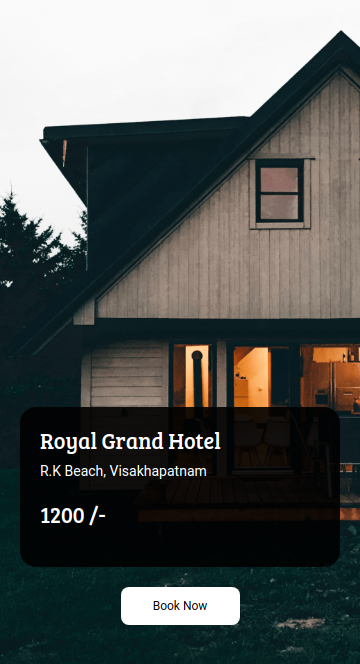

# 🏨 Hotel Booking Page

**Status:** Solved
**Difficulty:** Easy

---

## 📖 Assignment Description

In this assignment, let's build a **Hotel Booking Page** by applying the concepts learned so far. Bootstrap concepts can also be used to create the page.

The objective is to recreate the given hotel booking page design as closely as possible while focusing on layout, typography, colors, and component styling.

---

## 🖼️ Reference Design



---

## ⚠️ Note

- Try to achieve the design as close as possible.

---

## 📦 Resources

### Background Image

https://d2clawv67efefq.cloudfront.net/ccbp-static-website/hotelbg.png

---

## 🎨 Design Details

### Card Background Color

- `#000000e6`

### Button Background Color

- `#ffffff`

### Text Color

- `#ffffff`

### Font Families

- **Bree Serif**
- **Roboto**

---

## 📂 Project Structure

```text
hotel-booking-page/
├── index.html
├── style.css
├── README.md
└── reference-image/
    └── hotel-v1.png
```

---

## 📚 Concepts Practiced

- HTML page structure
- CSS styling and positioning
- Bootstrap components
- Background images
- Typography and color schemes
- Button customization
- Card-based layouts

---

## 🎯 Learning Outcome

Through this project, I learned how to:

- Create attractive booking page layouts
- Apply Bootstrap concepts effectively
- Use background images to enhance visual appeal
- Design cards and buttons with custom styling
- Recreate UI designs with attention to detail

---

## 🛠️ Technologies Used

- HTML5
- CSS3
- Bootstrap

---

⭐ This project is part of my **NxtWave Coding Practice Repository** and reflects my progress in learning modern web development concepts.
