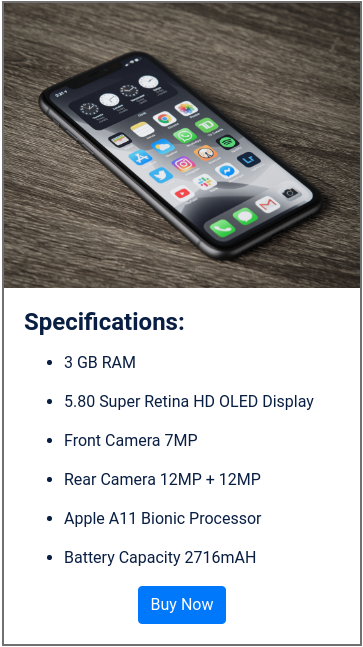

# 📱 Mobile Specifications Page

**Status:** Solved
**Difficulty:** Easy

---

## 📖 Assignment Description

In this assignment, let's build a **Mobile Specifications Page** by applying the concepts learned so far. Bootstrap concepts can also be used to create the page.

The objective is to create a webpage that displays the specifications and details of a mobile device in a clean, organized, and user-friendly format.

---

## 🖼️ Reference Design



---

## ⚠️ Note

- Try to achieve the design as close as possible.

---

## 📦 Resources

### Mobile Image

- https://d2clawv67efefq.cloudfront.net/ccbp-static-website/iphoneX-bg.png

---

## 🎨 Design Details

### Font Family

- **Roboto**

### Styling

- Custom border colors and text colors as provided in the assignment design.
- Responsive layout created using Bootstrap components.

---

## 📂 Project Structure

```text
mobile-specifications-page/
├── index.html
├── style.css
├── README.md
└── reference-image/
    └── mobile-store-page-v1.png
```

---

## 📚 Concepts Practiced

- HTML page structure
- CSS styling
- Bootstrap components
- Responsive layouts
- Images and media integration
- Typography and content organization
- Lists and specification sections

---

## 🎯 Learning Outcome

Through this project, I learned how to:

- Create structured product information pages
- Display technical specifications in a readable format
- Use Bootstrap for responsive layouts
- Organize content using sections and lists
- Build clean and user-friendly UI designs

---

## 🛠️ Technologies Used

- HTML5
- CSS3
- Bootstrap

---

⭐ This project is part of my **NxtWave Coding Practice Repository** and reflects my progress in learning modern web development concepts.
