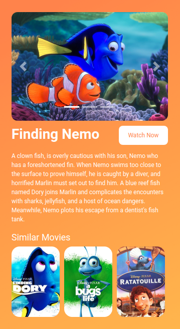

# 🎬 Movie Page

**Status:** Solved
**Difficulty:** Easy

---

## 📖 Assignment Description

In this assignment, let's build a **Movie Page** by applying the concepts learned so far. Bootstrap concepts can also be used to create the page.

The objective is to create a movie information page featuring a movie banner, image carousel, movie description, and a section displaying similar movies.

---

## 🖼️ Reference Design



---

## ⚠️ Note

- Try to achieve the design as close as possible.

---

## 📦 Resources

### Background Image

- https://d2clawv67efefq.cloudfront.net/ccbp-static-website/orange-color-bg.png

### Carousel Images

- https://d2clawv67efefq.cloudfront.net/ccbp-static-website/nemo-c1-img.png
- https://d2clawv67efefq.cloudfront.net/ccbp-static-website/nemo-c2-img.png
- https://d2clawv67efefq.cloudfront.net/ccbp-static-website/nemo-c3-img.png

### Similar Movies

- https://d2clawv67efefq.cloudfront.net/ccbp-static-website/finding-dory-img.png
- https://d2clawv67efefq.cloudfront.net/ccbp-static-website/bugslife-img.png
- https://d2clawv67efefq.cloudfront.net/ccbp-static-website/ratatouille-movie-img.png

---

## 🎨 Design Details

### Font Family

- **Roboto**

### Bootstrap Hint

- Use the Bootstrap class `justify-content-between` to create equal spacing between elements.

---

## 📂 Project Structure

```text
movie-page/
├── index.html
├── style.css
├── README.md
└── reference-image/
    └── movie-nemo-page-v1.png
```

---

## 📚 Concepts Practiced

- Bootstrap Carousel
- Responsive Layout Design
- Image Galleries
- Movie Information Layouts
- Flexbox Utilities
- HTML Structure
- CSS Styling
- Bootstrap Components

---

## 🎯 Learning Outcome

Through this project, I learned how to:

- Create engaging movie showcase pages
- Implement image carousels using Bootstrap
- Organize content sections effectively
- Display related content using card-like layouts
- Use Bootstrap utility classes for alignment and spacing

---

## 🛠️ Technologies Used

- HTML5
- CSS3
- Bootstrap

---

⭐ This project is part of my **NxtWave Coding Practice Repository** and reflects my progress in learning modern web development concepts.
