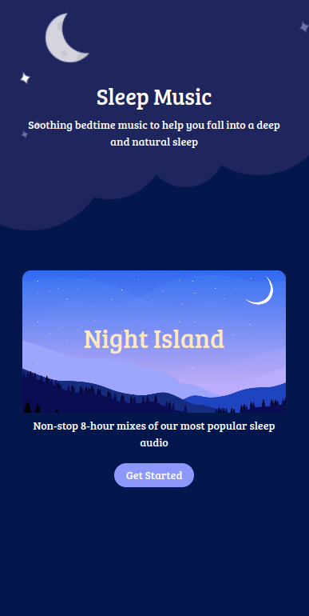
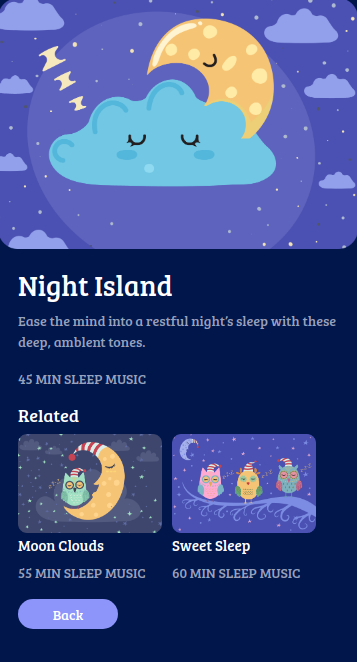

# 🎵 Music Page

**Status:** Solved
**Difficulty:** Easy

---

## 📖 Assignment Description

In this assignment, let's build a **Music Page** by applying the concepts learned so far. Bootstrap concepts and the **CCBP UI Kit** can also be used.

The project consists of two sections:

* Music Home Page
* Music Details Page

When the **Get Started** button on the Music Home Page is clicked, the user should be navigated to the Music Details Page.

---

## 🖼️ Reference Design

### Music Home Page



### Music Details Page



> Replace the image names with your actual reference image filenames.

---

## ⚠️ Notes

* Try to achieve the design as close as possible.
* Clicking the **Get Started** button should navigate to the Music Details Page.
* Bootstrap and CCBP UI Kit can be used.

---

## 🚨 Important CCBP UI Kit Guidelines

### Section IDs

The CCBP UI Kit works only when section IDs start with the prefix `section`.

✅ Correct:

```html id="nyqz9v"
<div id="sectionHomePage"></div>
<div id="sectionMusicDetailsPage"></div>
```

❌ Incorrect:

```html id="xg7k2w"
<div id="homePage"></div>
```

### Section Structure

* Sections must be parallel.
* Sections should not be nested within each other.

### Bootstrap Usage

Avoid applying Bootstrap flex properties directly to section containers.

---

## 📦 Resources

### Music Home Page Images

* https://d2clawv67efefq.cloudfront.net/ccbp-static-website/moon-bg.png
* https://new-assets.ccbp.in/frontend/static-website/moon-stars-bg.png

### Music Details Page Images

* https://d2clawv67efefq.cloudfront.net/ccbp-static-website/clouds-img.png
* https://d2clawv67efefq.cloudfront.net/ccbp-static-website/moon-clouds-img.png
* https://d2clawv67efefq.cloudfront.net/ccbp-static-website/sweet-sleep-img.png

---

## 🎨 Design Details

### Font Family

* **Bree Serif**

### Styling

* Custom background colors and text colors as provided in the assignment design.
* Responsive layouts built using Bootstrap and CCBP UI Kit.

---

## 📂 Project Structure

```text
music-page/
├── index.html
├── style.css
├── README.md
└── reference-image/
    ├── sleep-music-page.png
    └── sleep-music-page-2-v1.png
```

---

## 📚 Concepts Practiced

* CCBP UI Kit Navigation
* Multi-Section Web Applications
* Bootstrap Components
* Responsive Layout Design
* Background Images
* HTML Structure
* CSS Styling
* Content Organization

---

## 🎯 Learning Outcome

Through this project, I learned how to:

* Create multi-section webpages using CCBP UI Kit
* Navigate between sections using buttons
* Build visually appealing UI using background images
* Create responsive layouts with Bootstrap
* Organize content effectively across multiple sections

---

## 🛠️ Technologies Used

* HTML5
* CSS3
* Bootstrap
* CCBP UI Kit

---

⭐ This project is part of my **NxtWave Coding Practice Repository** and reflects my progress in learning modern web development concepts.
