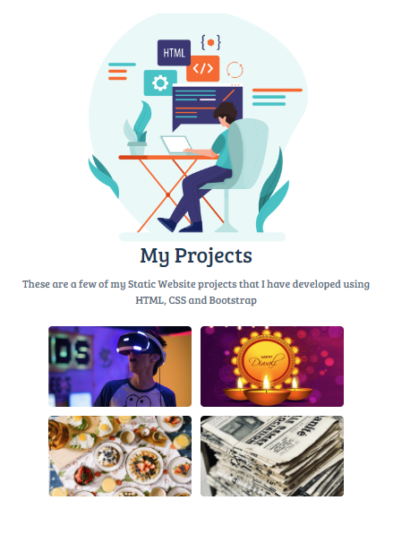
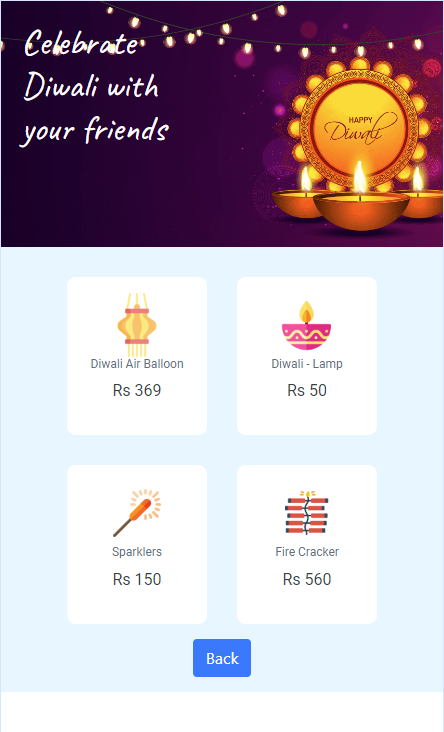
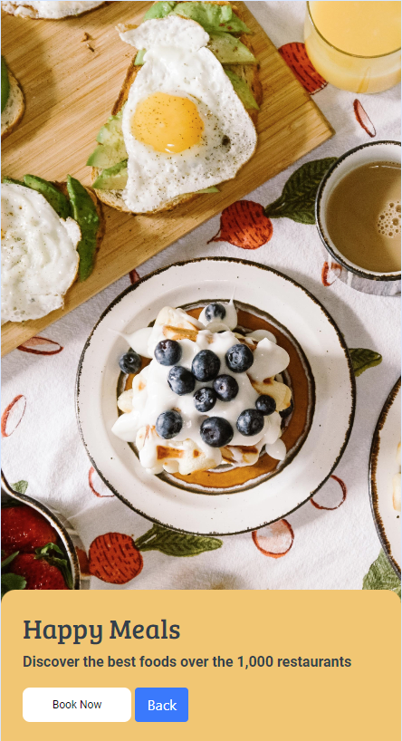
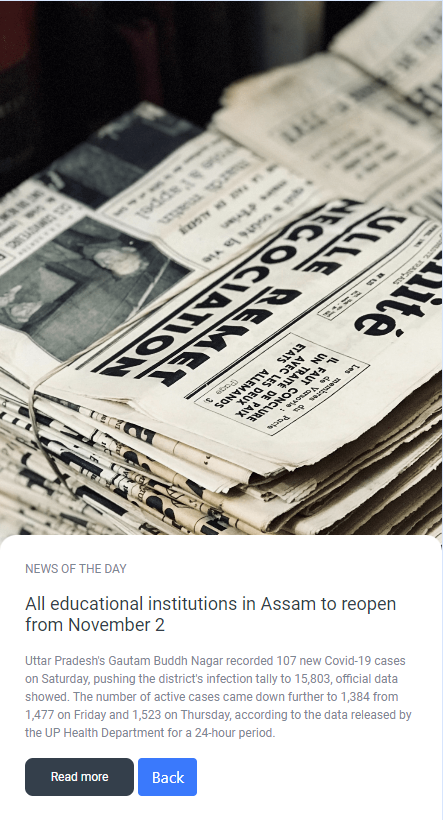

# 💼 My Projects Page

**Status:** Solved
**Difficulty:** Easy

---

## 📖 Assignment Description

In this assignment, let's build a **My Projects Page** by applying the concepts learned so far. Bootstrap concepts and the **CCBP UI Kit** can also be used.

The objective is to create a portfolio-style webpage that showcases multiple projects. Users can click on a project card to navigate to the respective project page.

The page includes:

- Home Page
- Advanced Technologies Page
- Diwali Page
- Happy Meals Page
- Newspaper Article Page

We can also add additional projects that we have completed.

---

## 🖼️ Reference Design

### Demo GIF

.gif>)

### Home Page



### Advanced Technologies Page


### Diwali Page



### Happy Meals Page



### Newspaper Article Page



---

## ⚠️ Notes

- Try to achieve the design as close as possible.
- Users should be able to navigate between the home page and project pages.
- Additional projects can be added to extend the portfolio.

---

## 🚨 Important CCBP UI Kit Guidelines

### Section IDs

The CCBP UI Kit works only when section IDs start with the prefix `section`.

✅ Correct:

```html
<div id="sectionHomePage"></div>
<div id="sectionAdvancedTechnologiesPage"></div>
```

❌ Incorrect:

```html
<div id="homePage"></div>
```

### Section Structure

- Sections must be parallel.
- Sections should not be nested within each other.

### Bootstrap Usage

Avoid applying Bootstrap flex properties directly to section containers.

❌ Example:

```html
<div id="sectionHomepage" class="d-flex"></div>
```

---

## 📦 Resources

### Images

- https://d2clawv67efefq.cloudfront.net/ccbp-static-website/software-developer-img.png
- https://d2clawv67efefq.cloudfront.net/ccbp-static-website/advanced-technologies-img.png
- https://d2clawv67efefq.cloudfront.net/ccbp-static-website/diwali-img.png
- https://d2clawv67efefq.cloudfront.net/ccbp-static-website/food-img.png
- https://d2clawv67efefq.cloudfront.net/ccbp-static-website/news-paper-img.png

---

## 🎨 Design Details

### Font Family

- **Bree Serif**

---

## 📂 Project Structure

```text
my-projects-page/
├── index.html
├── style.css
├── README.md
└── reference-image/
    ├── my-projects (1).gif
    ├── CP_13_MyProjects_1_ur0i6x.png
    ├── CP_13_MyProjects_2_wlvbjn.png
    ├── CP_13_MyProjects_3_amybjk.png
    ├── CP_13_MyProjects_4_rsch6q.png
    └── CP_13_MyProjects_5_o7mqam.png
```

---

## 📚 Concepts Practiced

- CCBP UI Kit Navigation
- Portfolio Page Design
- Multi-Section Web Applications
- Bootstrap Components
- Responsive Layout Design
- Image Cards
- HTML Structure
- CSS Styling

---

## 🎯 Learning Outcome

Through this project, I learned how to:

- Create a personal project portfolio webpage
- Navigate between multiple sections using CCBP UI Kit
- Organize and showcase projects effectively
- Build responsive layouts using Bootstrap
- Design attractive project cards and layouts

---

## 🛠️ Technologies Used

- HTML5
- CSS3
- Bootstrap
- CCBP UI Kit

---

## 🚀 Future Enhancements

- Add more completed projects
- Improve UI and animations
- Add project filtering and categorization
- Convert the page into a fully responsive portfolio website

---

⭐ This project is part of my **NxtWave Coding Practice Repository** and reflects my progress in learning modern web development concepts.
