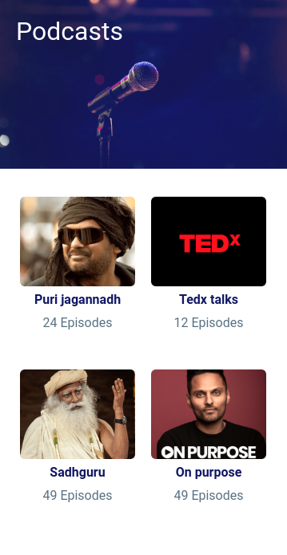
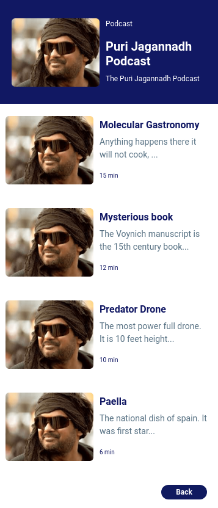
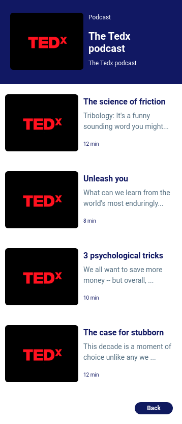
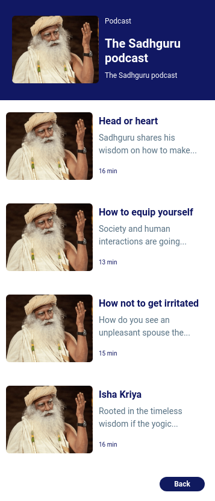
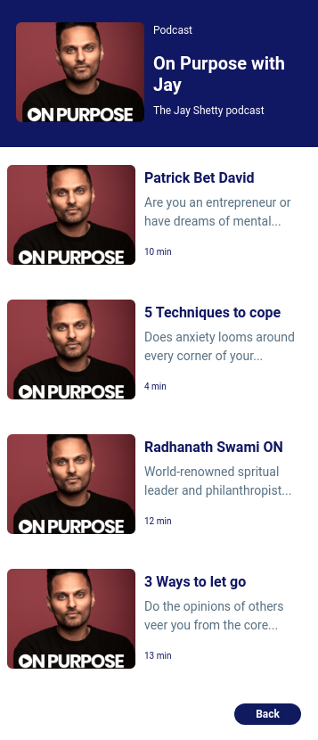

# 🎙️ Podcast Page

**Status:** Solved
**Difficulty:** Easy

---

## 📖 Assignment Description

In this assignment, let's build a **Podcast Page** by applying the concepts learned so far. Bootstrap concepts and the **CCBP UI Kit** can also be used.

The project consists of multiple sections:

* Podcast Home Page
* Puri Jagannadh Podcast Page
* TEDx Podcast Page
* Sadhguru Podcast Page
* On Purpose Podcast Page

When a podcast category is selected from the Home Page, the corresponding podcast page should be displayed. Clicking the **Back** button should navigate back to the Podcast Home Page.

---

## 🖼️ Reference Design

### Podcast Home Page



### Puri Jagannadh Page



### TEDx Page



### Sadhguru Page



### On Purpose Page



---

## ⚠️ Notes

* Try to achieve the design as close as possible.
* Clicking on a podcast category should open the respective podcast page.
* Clicking the Back button should return to the Podcast Home Page.
* Bootstrap and CCBP UI Kit can be used.

---

## 🚨 Important CCBP UI Kit Guidelines

### Section IDs

The CCBP UI Kit works only when section IDs start with the prefix `section`.

✅ Correct:

```html id="1f9k5s"
<div id="sectionHomePage"></div>
<div id="sectionPuriJagannadhPage"></div>
```

❌ Incorrect:

```html id="3wv51x"
<div id="homePage"></div>
```

### Section Structure

* Sections must be parallel.
* Sections should not be nested within each other.

### Bootstrap Usage

Avoid applying Bootstrap flex properties directly to section containers.

---

## 📦 Resources

### Background Image

* https://d2clawv67efefq.cloudfront.net/ccbp-static-website/podcasts-bg.png

### Podcast Images

* https://d2clawv67efefq.cloudfront.net/ccbp-static-website/puri-jagannadh-img.png
* https://d2clawv67efefq.cloudfront.net/ccbp-static-website/tedx-img.png
* https://d2clawv67efefq.cloudfront.net/ccbp-static-website/sadhguru-img.png
* https://d2clawv67efefq.cloudfront.net/ccbp-static-website/on-purpose-img.png

---

## 🎨 Design Details

### Font Family

* **Roboto**

### Styling

* Custom background colors and text colors as provided in the assignment design.
* Responsive layouts built using Bootstrap and CCBP UI Kit.

---

## 📂 Project Structure

```text id="1cwt9v"
podcast-page/
├── index.html
├── style.css
├── README.md
└── reference-image/
    ├── podcast-v1.png
    ├── podcast-puri-jagannadh-v1.png
    ├── podcast-tedx-v1.png
    ├── podcast-sadhguru-v1.png
    └── podcast-on-purpose-v1.png
```

---

## 📚 Concepts Practiced

* CCBP UI Kit Navigation
* Multi-Section Web Applications
* Bootstrap Components
* Responsive Layout Design
* Image Integration
* HTML Structure
* CSS Styling
* Content Organization

---

## 🎯 Learning Outcome

Through this project, I learned how to:

* Create multi-section webpages using CCBP UI Kit
* Navigate between sections using buttons and links
* Build responsive layouts with Bootstrap
* Organize content effectively across multiple pages
* Apply consistent styling and design principles

---

## 🛠️ Technologies Used

* HTML5
* CSS3
* Bootstrap
* CCBP UI Kit

---

⭐ This project is part of my **NxtWave Coding Practice Repository** and reflects my progress in learning modern web development concepts.
