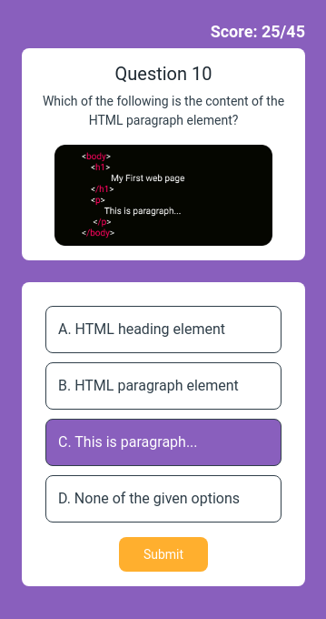

# ❓ Quiz Question Page

**Status:** Solved
**Difficulty:** Easy

---

## 📖 Assignment Description

In this assignment, let's build a **Quiz Question Page** by applying the concepts learned so far. Bootstrap concepts can also be used to create the page.

The objective is to design an interactive-looking quiz interface that displays a coding-related question along with multiple answer options in a clean and structured layout.

---

## 🖼️ Reference Design



---

## ⚠️ Note

* Try to achieve the design as close as possible.

---

## 📦 Resources

### Question Image

* https://d2clawv67efefq.cloudfront.net/ccbp-static-website/coding-question-img.png

---

## 🎨 Design Details

### Font Family

* **Roboto**

### Styling

* Custom background colors and text colors as provided in the assignment design.
* Responsive layout created using Bootstrap components.

---

## 📂 Project Structure

```text
quiz-question-page/
├── index.html
├── style.css
├── README.md
└── reference-image/
    └── quiz-page-v1.png
```

---

## 📚 Concepts Practiced

* Bootstrap Components
* Cards and Containers
* Responsive Layout Design
* Typography and Styling
* Images and Media Integration
* HTML Structure
* CSS Customization

---

## 🎯 Learning Outcome

Through this project, I learned how to:

* Design structured quiz interfaces
* Create visually appealing question-and-answer layouts
* Use Bootstrap components for responsive design
* Organize content effectively using cards and containers
* Apply typography and spacing techniques for better readability

---

## 🛠️ Technologies Used

* HTML5
* CSS3
* Bootstrap

---

⭐ This project is part of my **NxtWave Coding Practice Repository** and reflects my progress in learning modern web development concepts.