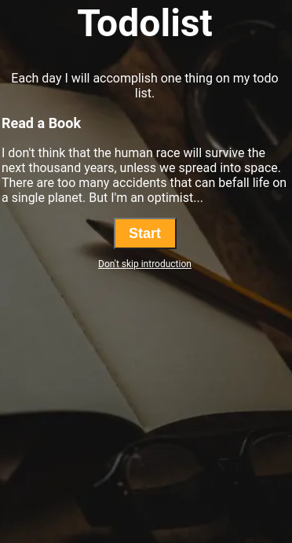

# 📝 Todolist

**Status:** Solved  
**Difficulty:** Easy

---

## 📖 Assignment Description

In this assignment, let's build a **Todolist** by applying the concepts we learned till now.

Refer to the given design and try to match it as closely as possible.

---

## 🖼️ Reference Design

---

## ⚠️ Note

- Try to achieve the design as close as possible.

---

## 📦 Resources

Use the following background image:

👉 https://d2clawv67efefq.cloudfront.net/ccbp-static-website/todolistbg.png

---

## 🎨 CSS Details

### Colors Used

- Background color for button: **orange**
- Text color: **white**

### Font Family

- **Roboto**

---

## 📚 Concepts Review

Want to quickly review some of the concepts you’ve been learning?

👉 Take a look at the Cheat Sheets.

---

⭐ This project is part of my NxtWave coding practice.
